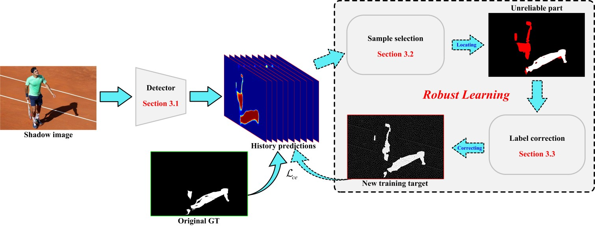
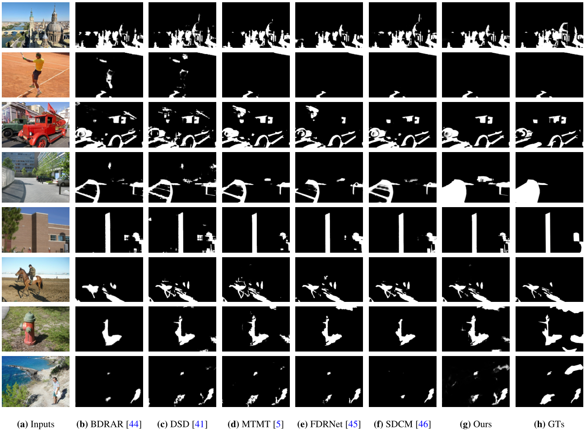

# Exploring Better Target for Shadow Detection
by Wen Wu, Xiao-Diao Chen, Wenya Yang, and Jun-Hai Yong

#### News: In 2023.3.21, We release the unsorted code for other researchers. The sorted code will be released after.

***


## Shadow detection results at test datasets
The results of shadow detection on three datasets (SBU, UCF, ISTD) can be found at [BaiduNetdisk](https://pan.baidu.com/s/1v3yflIR3kn6QyC1OLzl_eQ)(8myd).

## Visual comparison with SOTA


## Requirement
* Python 3.6
* PyTorch 1.10
* torchvision
* timm 0.3.2
* numpy
* tqdm
* PIL
* pydensecrf ([here](https://github.com/Andrew-Qibin/dss_crf) to install)

## Training
1. Set ...
2. Set ...
3. Run by ```python train.py```

The pretrained Mit-B2 model is ported from the [official](https://github.com/NVlabs/SegFormer) torch version.

## Testing
1. Set ...
2. Put ...
2. Run by ```python test.py```

## Useful links
UCF dataset: [BaiduNetdisk](https://pan.baidu.com/s/1xijuxXullcGNkMkFK_reUQ)(fovr)

SBU dataset: [BaiduNetdisk](https://pan.baidu.com/s/19-k2aZUXnQOlwkcgROb3hA)(o4it)

ISTD dataset: [BaiduNetdisk](https://pan.baidu.com/s/1AwjUwTVRZJSWTYiSGUpJAw)(ni0z)

CUHK_Shadow dataset: [BaiduNetdisk](https://pan.baidu.com/s/1j1sgt2qu1H4Y7jWwRsZnVw)(z7pt)

